# SPRING CLOUD 框架微服务 STUDY

# 第一章 微服务架构

## 1.1 微服务架构概述

> 概述


==基于分布式的微服务架构==

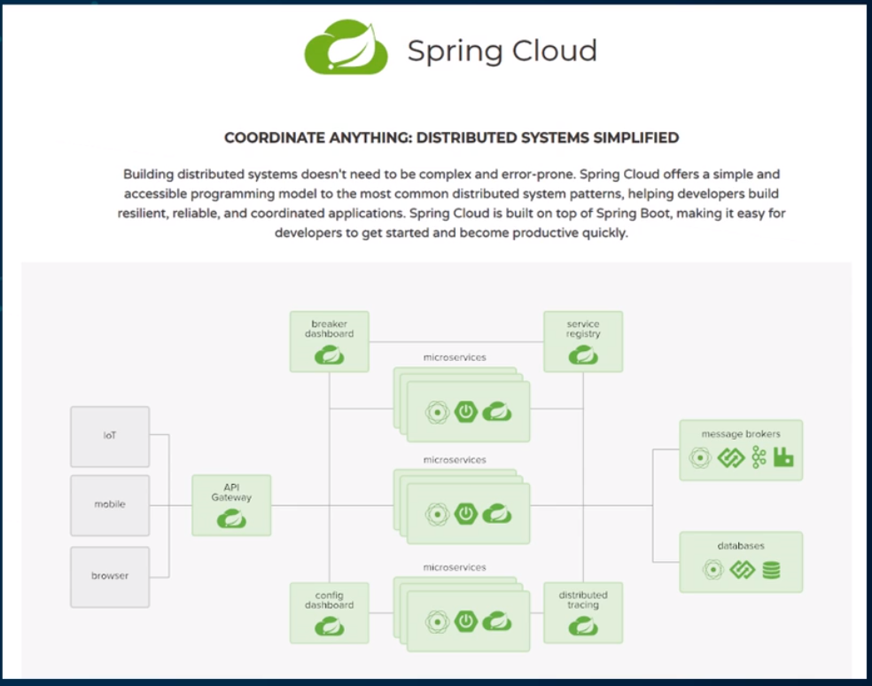


## 1.2 Spring Cloud 简介

> 简介


- 京东商城 微服务 架构体系

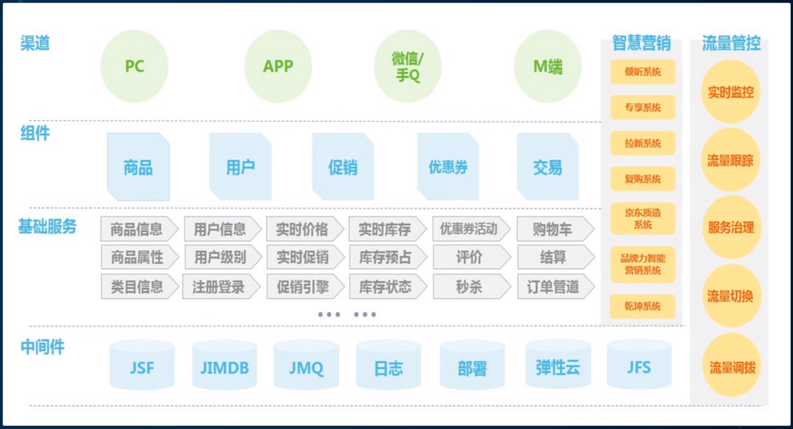

- 阿里云

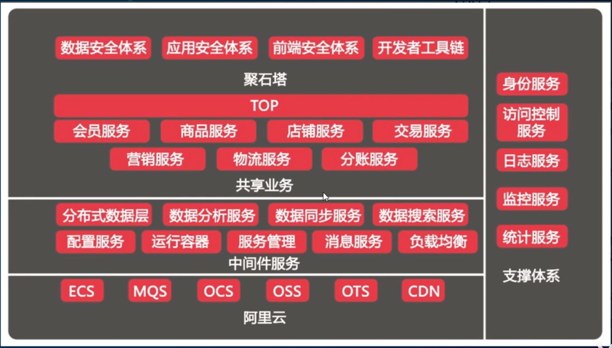

- 京东物流

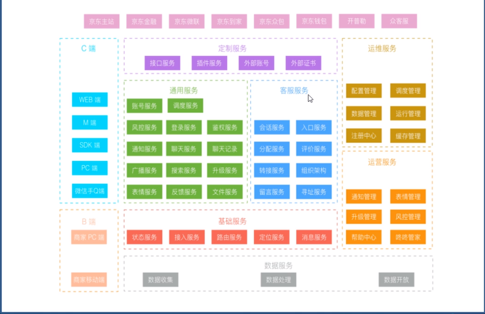


- 无业务基础服务 与 业务型基础服务

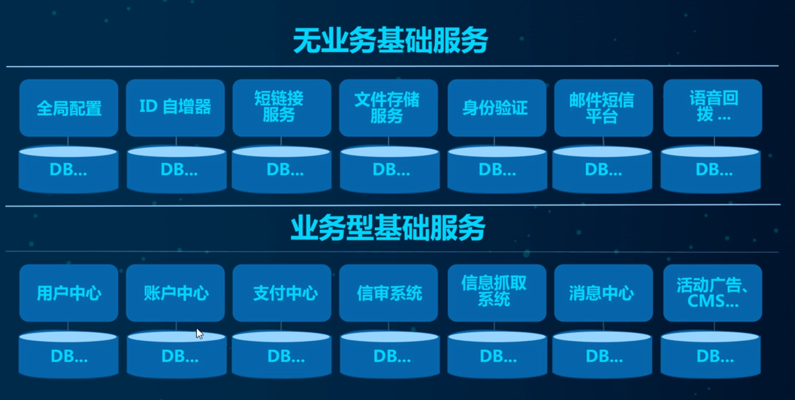

## 1.3 Spring Cloud技术栈

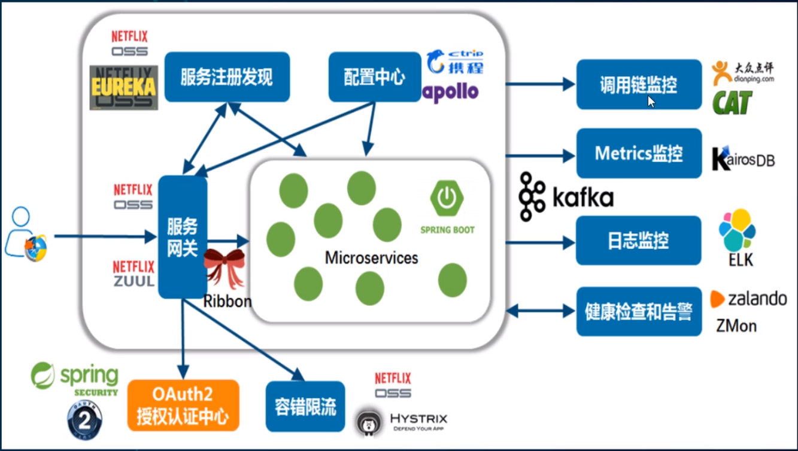

- **主要技术栈**

> - 服务注册与发现
>   - EUREKA
> - 服务负载与调用    
>   - NETFLIX OSS RIBBON
>   - NETFLIX FEIGN
> - 服务熔断降级
>   - HYSTRIX
> - 服务网关
>   - NETFLIX OSS Zuul
> - 服务分布式配置
>   - Spring Cloud Config
> - 服务开发
>   - Spring Boot


## 1.4 总结

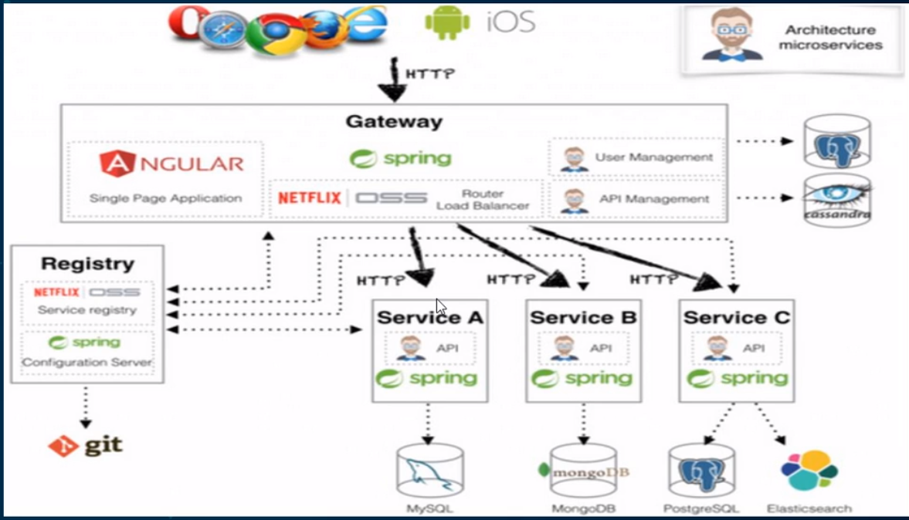

# 第二章 springcloud 父工程组件

> 版本选择

版本:springboot 2.0（2.2/2.3） & spring cloud H版 

版本配置

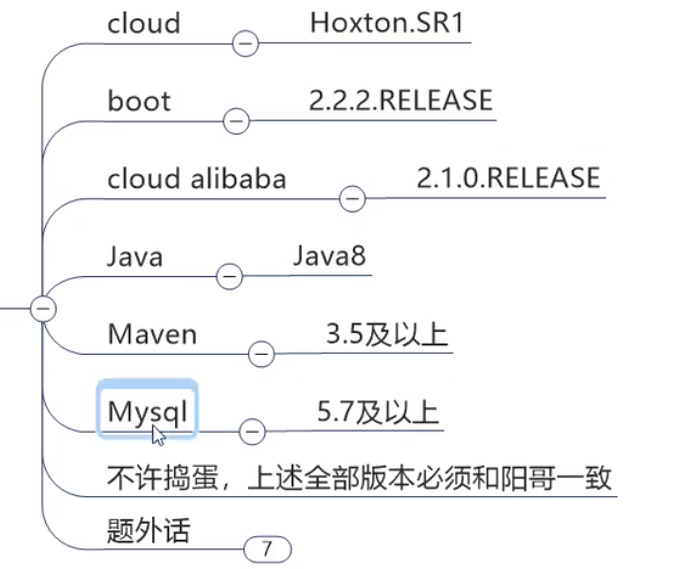


H版 版本

https://docs.spring.io/spring-cloud/docs/Hoxton.SR11/reference/html/

> **SpringCloud** 组件 更替

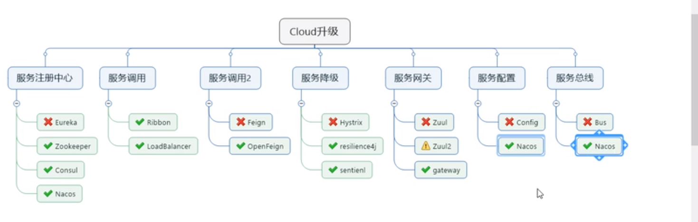


## 2.1 springcloud 父工程创建

约定 > 配置 > 编码

> 创建微服务cloud整体聚合父工程Project，有8个关键步骤：
>
> - New Project - maven工程 - create from archetype: maven-archetype-site
> - 聚合总父工程名字
> - Maven选版本
> - 工程名字
> - 字符编码 - Settings - File encoding
> - 注解生效激活 - Settings - Annotation Processors
> - Java编译版本选8
> - File Type过滤 - Settings - File Type

父工程pom文件


```xml
<?xml version="1.0" encoding="UTF-8"?>

<project xmlns="http://maven.apache.org/POM/4.0.0" xmlns:xsi="http://www.w3.org/2001/XMLSchema-instance"
         xsi:schemaLocation="http://maven.apache.org/POM/4.0.0 http://maven.apache.org/xsd/maven-4.0.0.xsd">
    <modelVersion>4.0.0</modelVersion>  
    <groupId>com.lun</groupId>
    <artifactId>LearnCloud</artifactId>
    <version>1.0.0-SNAPSHOT</version>
    <packaging>pom</packaging><!-- 这里添加，注意不是jar或war -->

    <!-- 统一管理jar包版本 -->
    <properties>
        <project.build.sourceEncoding>UTF-8</project.build.sourceEncoding>
        <maven.compiler.source>1.8</maven.compiler.source>
        <maven.compiler.target>1.8</maven.compiler.target>
        <junit.version>4.12</junit.version>
        <log4j.version>1.2.17</log4j.version>
        <lombok.version>1.16.18</lombok.version>
        <mysql.version>5.1.47</mysql.version>
        <druid.version>1.1.16</druid.version>
        <mybatis.spring.boot.version>1.3.0</mybatis.spring.boot.version>
    </properties>

    <!-- 子模块继承之后，提供作用：
 锁定版本+子modlue不用写groupId和version -->
    <dependencyManagement>
        <dependencies>
            <!--spring boot 2.2.2-->
            <dependency>
                <groupId>org.springframework.boot</groupId>
                <artifactId>spring-boot-dependencies</artifactId>
                <version>2.2.2.RELEASE</version>
                <type>pom</type>
                <scope>import</scope>
            </dependency>
            <!--spring cloud Hoxton.SR1-->
            <dependency>
                <groupId>org.springframework.cloud</groupId>
                <artifactId>spring-cloud-dependencies</artifactId>
                <version>Hoxton.SR1</version>
                <type>pom</type>
                <scope>import</scope>
            </dependency>
            <!--spring cloud alibaba 2.1.0.RELEASE-->
            <dependency>
                <groupId>com.alibaba.cloud</groupId>
                <artifactId>spring-cloud-alibaba-dependencies</artifactId>
                <version>2.1.0.RELEASE</version>
                <type>pom</type>
                <scope>import</scope>
            </dependency>
            <dependency>
                <groupId>mysql</groupId>
                <artifactId>mysql-connector-java</artifactId>
                <version>${mysql.version}</version>
            </dependency>
            <dependency>
                <groupId>com.alibaba</groupId>
                <artifactId>druid</artifactId>
                <version>${druid.version}</version>
            </dependency>
            <dependency>
                <groupId>org.mybatis.spring.boot</groupId>
                <artifactId>mybatis-spring-boot-starter</artifactId>
                <version>${mybatis.spring.boot.version}</version>
            </dependency>
            <dependency>
                <groupId>junit</groupId>
                <artifactId>junit</artifactId>
                <version>${junit.version}</version>
            </dependency>
            <dependency>
                <groupId>log4j</groupId>
                <artifactId>log4j</artifactId>
                <version>${log4j.version}</version>
            </dependency>
            <dependency>
                <groupId>org.projectlombok</groupId>
                <artifactId>lombok</artifactId>
                <version>${lombok.version}</version>
                <optional>true</optional>
            </dependency>
        </dependencies>
    </dependencyManagement>

    <build>
        <plugins>
            <plugin>
                <groupId>org.springframework.boot</groupId>
                <artifactId>spring-boot-maven-plugin</artifactId>
                <configuration>
                    <fork>true</fork>
                    <addResources>true</addResources>
                </configuration>
            </plugin>
        </plugins>
    </build>
</project>
```


> 注意：
>
> Maven使用`dependencyManagement`元素来提供了一种管理依赖版本号的方式。
>
> 通常会在一个组织或者项目的最顶层的父POM中看到`dependencyManagement`元素。
>
> 使用pom.xml中的`dependencyManagement`元素能让所有在子项目中引用个依赖而不用显式的列出版本量。
>
> Maven会沿着父子层次向上走，直到找到一个拥有`dependencyManagement`元素的项目，然后它就会使用这个

~~~xml
<dependencyManagement>
    <dependencies>
        <dependency>
        <groupId>mysq1</groupId>
        <artifactId>mysql-connector-java</artifactId>
        <version>5.1.2</version>
        </dependency>
    <dependencies>
</dependencyManagement>
~~~

然后在子项目里就可以添加`mysql-connector`时可以不指定版本号，例如：

```xml
<dependencies>
    <dependency>
    <groupId>mysq1</groupId>
    <artifactId>mysql-connector-java</artifactId>
    </dependency>
</dependencies>
```

这样做的好处就是：如果有多个子项目都引用同一样依赖，则可以避免在每个使用的子项目里都声明一个版本号，这样当想升级或切换到另一个版本时，只需要在顶层父容器里更新，而不需要一个一个子项目的修改；另外如果某个子项目需要另外的一个版本，只需要声明version就可。

dependencyManagement里只是声明依赖，并不实现引入，因此子项目需要显示的声明需要用的依赖。
如果不在子项目中声明依赖，是不会从父项目中继承下来的；只有在子项目中写了该依赖项,并且没有指定具体版本，才会从父项目中继承该项，并且version和scope都读取自父pom。
如果子项目中指定了版本号，那么会使用子项目中指定的jar版本。

------

IDEA右侧旁的Maven插件有`Toggle ' Skip Tests' Mode`按钮，这样maven可以跳过单元测试

------

父工程创建完成执行`mvn : install`将父工程发布到仓库方便子工程继承。


## 2.2 REST微服务工程构建

### 2.2.1 支付模块的创建

创建微服务模块套路：

1. 建Module
2. 改POM
3. 写YML
4. 主启动
5. 业务类


**1.建名为cloud-provider-payment8001的Maven工程**

**2.改POM**

```xml
<?xml version="1.0" encoding="UTF-8"?>
<project xmlns="http://maven.apache.org/POM/4.0.0"
         xmlns:xsi="http://www.w3.org/2001/XMLSchema-instance"
         xsi:schemaLocation="http://maven.apache.org/POM/4.0.0 http://maven.apache.org/xsd/maven-4.0.0.xsd">
    <parent>
        <artifactId>geek-springcloud</artifactId>
        <groupId>com.geek.springcloud</groupId>
        <version>1.0-SNAPSHOT</version>
    </parent>
    <modelVersion>4.0.0</modelVersion>

    <artifactId>cloud-provider-payment8001</artifactId>

    <dependencies>
        <!--包含了sleuth+zipkin-->
        <dependency>
            <groupId>org.springframework.cloud</groupId>
            <artifactId>spring-cloud-starter-zipkin</artifactId>
        </dependency>
        <!--eureka-client-->
        <dependency>
            <groupId>org.springframework.cloud</groupId>
            <artifactId>spring-cloud-starter-netflix-eureka-client</artifactId>
        </dependency>
        <!-- 引入自己定义的api通用包，可以使用Payment支付Entity -->
        <!--
        <dependency>
            <groupId>com.atguigu.springcloud</groupId>
            <artifactId>cloud-api-commons</artifactId>
            <version>${project.version}</version>
        </dependency>
        -->
        <dependency>
            <groupId>org.springframework.boot</groupId>
            <artifactId>spring-boot-starter-web</artifactId>
        </dependency>
        <dependency>
            <groupId>org.springframework.boot</groupId>
            <artifactId>spring-boot-starter-actuator</artifactId>
        </dependency>
        <dependency>
            <groupId>org.mybatis.spring.boot</groupId>
            <artifactId>mybatis-spring-boot-starter</artifactId>
        </dependency>
        <dependency>
            <groupId>com.alibaba</groupId>
            <artifactId>druid-spring-boot-starter</artifactId>
            <version>1.1.10</version>
        </dependency>
        <!--mysql-connector-java-->
        <dependency>
            <groupId>mysql</groupId>
            <artifactId>mysql-connector-java</artifactId>
        </dependency>
        <!--jdbc-->
        <dependency>
            <groupId>org.springframework.boot</groupId>
            <artifactId>spring-boot-starter-jdbc</artifactId>
        </dependency>
        <dependency>
            <groupId>org.springframework.boot</groupId>
            <artifactId>spring-boot-devtools</artifactId>
            <scope>runtime</scope>
            <optional>true</optional>
        </dependency>
        <dependency>
            <groupId>org.projectlombok</groupId>
            <artifactId>lombok</artifactId>
            <optional>true</optional>
        </dependency>
        <dependency>
            <groupId>org.springframework.boot</groupId>
            <artifactId>spring-boot-starter-test</artifactId>
            <scope>test</scope>
        </dependency>
    </dependencies>

</project>
```

**3.写YML**

```yml
#springcloud yml config
server:
  port: 8001


spring:
  application:
    name: cloud-payment-service
  datasource:
    type: com.alibaba.druid.pool.DruidDataSource            # 当前数据源操作类型
    driver-class-name: com.mysql.jdbc.Driver            # mysql驱动包
    url: jdbc:mysql://localhost:3306/spring?useUnicode=true&characterEncoding=utf-8&useSSL=false
    username: root
    password: 123456

mybatis:
  mapperLocations: classpath:mapper/*.xml
  type-aliases-package: com.lun.springcloud.entities    # 所有Entity别名类所在包
```

**4.主启动**

PaymentMain8001

```java
package com.geek.springcloud;

import org.springframework.boot.SpringApplication;
import org.springframework.boot.autoconfigure.SpringBootApplication;

/**
 * @Author Robert
 * @create 2021/6/15 15:10
 * @Version 1.0
 * @Description: main program class
 */

@SpringBootApplication
public class PaymentMain8001 {

    public static void main(String[] args) {
        SpringApplication.run(PaymentMain8001.class,args);
    }
}
```

**5.业务类**

> SQL
>

~~~sql
CREATE TABLE `payment`(
	`id` bigint(20) NOT NULL AUTO_INCREMENT COMMENT 'ID',
    `serial` varchar(200) DEFAULT '',
	PRIMARY KEY (id)
)ENGINE=InnoDB AUTO_INCREMENT=1 DEFAULT CHARSET=utf8mb4

~~~

> **Entities**：

实体类Payment：

```java
package com.geek.springcloud.entities;

import lombok.AllArgsConstructor;
import lombok.Data;
import lombok.NoArgsConstructor;

import java.io.Serializable;

/**
 * @Author Robert
 * @create 2021/6/15 15:25
 * @Version 1.0
 * @Description: payment model
 */

@Data
@AllArgsConstructor
@NoArgsConstructor
public class Payment implements Serializable {
    //继承序列化
    private Long id;

    private String serial;
}

```

JSON封装体CommonResult：

```JAVA
package com.geek.springcloud.entities;

import lombok.AllArgsConstructor;
import lombok.Data;
import lombok.NoArgsConstructor;

/**
 * @Author Robert
 * @create 2021/6/15 15:28
 * @Version 1.0
 * @Description: JSON封装体CommonResult
 */

@Data
@AllArgsConstructor
@NoArgsConstructor
public class CommonResult<T> {

    private Integer code; // Data code; success or fail

    private String message; // Description

    //采用 泛型以确定传回的字符串 为其实体类型
    private T Data; //具体信息

    public CommonResult(Integer code,String message){
        this(code,message,null);
    }
}
```

> **DAO**：

接口PaymentDao：

```JAVA
package com.geek.springcloud.dao;

import com.geek.Payment;
import org.apache.ibatis.annotations.Mapper;
import org.apache.ibatis.annotations.Param;

/**
 * @Author Robert
 * @create 2021/6/15 15:35
 * @Version 1.0
 * @Description:
 */
@Mapper
public interface PaymentDao {

    public int create(Payment payment);

    public Payment getPaymentById(@Param("id") Long id);
}
```

MyBatis映射文件PaymentMapper.xml，路径：resources/mapper/PaymentMapper.xml	

```XML
<?xml version="1.0" encoding="UTF-8" ?>
<!DOCTYPE mapper PUBLIC "-//mybatis.org//DTD Mapper 3.0//EN" "http://mybatis.org/dtd/mybatis-3-mapper.dtd" >

<mapper namespace="com.geek.PaymentDao">

    <insert id="create" parameterType="Payment" useGeneratedKeys="true" keyProperty="id">
        insert into payment(serial)  values(#{serial});
    </insert>

    <!--作映射-->
    <resultMap id="BaseResultMap" type="com.geek.Payment">
        <id column="id" property="id" jdbcType="BIGINT"/>
        <id column="serial" property="serial" jdbcType="VARCHAR"/>
    </resultMap>

    <select id="getPaymentById" parameterType="Long" resultMap="BaseResultMap">
        select * from payment where id=#{id};
    </select>

</mapper>
```


> **Service**：

接口PaymentService

```JAVA
package com.geek.springcloud.service;

import com.geek.Payment;
import org.apache.ibatis.annotations.Param;

/**
 * @Author Robert
 * @create 2021/6/15 15:46
 * @Version 1.0
 * @Description:
 */
public interface PaymentService {

    public int create(Payment payment);

    public Payment getPaymentById(@Param("id") Long id);
}
```

实现类

```JAVA
package com.geek.springcloud.service.impl;

import com.geek.PaymentDao;
import com.geek.Payment;
import com.geek.PaymentService;
import org.springframework.stereotype.Service;

import javax.annotation.Resource;

/**
 * @Author Robert
 * @create 2021/6/15 15:47
 * @Version 1.0
 * @Description:
 */
@Service
public class PaymentServiceImpl implements PaymentService {

    @Resource
    private PaymentDao paymentDao;

    @Override
    public int create(Payment payment) {
        return paymentDao.create(payment);
    }

    @Override
    public Payment getPaymentById(Long id) {
        return paymentDao.getPaymentById(id);
    }
}
```

> **Controller**：

```JAVA
package com.geek.springcloud.controller;

import com.geek.CommonResult;
import com.geek.Payment;
import com.geek.PaymentService;
import lombok.extern.slf4j.Slf4j;
import org.springframework.web.bind.annotation.*;

import javax.annotation.Resource;

/**
 * @Author Robert
 * @create 2021/6/15 15:50
 * @Version 1.0
 * @Description:
 */

@RestController
@Slf4j
public class PaymentController {

    @Resource
    private PaymentService paymentService;

    @PostMapping("/payment/create")
    public CommonResult create(Payment payment){
        int result = paymentService.create(payment);
        log.info("-----插入结果："+result);
        if (result>0){
            return new CommonResult(200,"插入数据库成功");
        }else {
            return new CommonResult(403,"插入失败",null);
        }
    }

    @GetMapping("/payment/get/{id}")
    public CommonResult getPaymentById(@PathVariable("id") Long id){
        Payment payment = paymentService.getPaymentById(id);
        log.info("-----查询结果："+payment);
        if (payment!=null){
            return new CommonResult(200,"查询成功",payment);
        }else {
            return new CommonResult(403,"查询失败，没有对应记录，查询id："+id,null);
        }
    }

}
```

**6.测试**

1. 浏览器 - http://localhost:8001/payment/get/1
2. Postman - http://localhost:8001/payment/create?serial=lun2

**7.小总结**

创建微服务模块套路：

1. 建Module
2. 改POM
3. 写YML
4. 主启动
5. 业务类

### 2.2.2 热部署 自动化

开发时使用，生产环境关闭

**1.Adding devtools to your project**

~~~
<dependency>
    <groupId>org.springframework.boot</groupId>
    <artifactId>spring-boot-devtools</artifactId>
    <scope>runtime</scope>
    <optional>true</optional>
</dependency>
~~~

**2.Adding plugin to your pom.xml**

下段配置复制到聚合父类总工程的pom.xml

~~~xml
<build>
    <!--
	<finalName>你的工程名</finalName>（单一工程时添加）
    -->
    <plugins>
        <plugin>
            <groupId>org.springframework.boot</groupId>
            <artifactId>spring-boot-maven-plugin</artifactId>
            <configuration>
                <fork>true</fork>
                <addResources>true</addResources>
            </configuration>
        </plugin>
    </plugins>
</build>
~~~

**3.Enabling automatic build**

File -> Settings(New Project Settings->Settings for New Projects) ->Complier

下面项勾选

Automatically show first error in editor
Display notification on build completion
Build project automatically
Compile independent modules in parallel
**4.Update the value of**

键入Ctrl + Shift + Alt + / ，打开Registry，勾选：

compiler.automake.allow.when.app.running

actionSystem.assertFocusAccessFromEdt

**5.重启IDEA**


### 2.2.3 消费者订单模块

**1.建Module**

创建名为cloud-consumer-order80的maven工程。

**2.改POM**

~~~xml
<?xml version="1.0" encoding="UTF-8"?>

<project xmlns="http://maven.apache.org/POM/4.0.0" xmlns:xsi="http://www.w3.org/2001/XMLSchema-instance"
         xsi:schemaLocation="http://maven.apache.org/POM/4.0.0 http://maven.apache.org/xsd/maven-4.0.0.xsd">
  <parent>
    <artifactId>LearnCloud</artifactId>
    <groupId>com.lun</groupId>
    <version>1.0.0-SNAPSHOT</version>
  </parent>
  <modelVersion>4.0.0</modelVersion>

  <artifactId>cloud-consumer-order80</artifactId>

  <properties>
    <project.build.sourceEncoding>UTF-8</project.build.sourceEncoding>
    <maven.compiler.source>1.7</maven.compiler.source>
    <maven.compiler.target>1.7</maven.compiler.target>
  </properties>

  <dependencies>
    <dependency>
      <groupId>org.springframework.boot</groupId>
      <artifactId>spring-boot-starter-web</artifactId>
    </dependency>
    <dependency>
      <groupId>org.springframework.boot</groupId>
      <artifactId>spring-boot-starter-actuator</artifactId>
    </dependency>

    <dependency>
      <groupId>org.springframework.boot</groupId>
      <artifactId>spring-boot-devtools</artifactId>
      <scope>runtime</scope>
      <optional>true</optional>
    </dependency>
    <dependency>
      <groupId>org.projectlombok</groupId>
      <artifactId>lombok</artifactId>
      <optional>true</optional>
    </dependency>
    <dependency>
      <groupId>org.springframework.boot</groupId>
      <artifactId>spring-boot-starter-test</artifactId>
      <scope>test</scope>
    </dependency>
  </dependencies>
</project>
~~~

**3.写YML**

~~~yml

server:
  port: 80

~~~

**4.主启动**

~~~java
import org.springframework.boot.SpringApplication;
import org.springframework.boot.autoconfigure.SpringBootApplication;

/**
 * Hello world!
 *
 */
@SpringBootApplication
public class OrderMain80
{
    public static void main( String[] args ){
        SpringApplication.run(OrderMain80.class, args);
    }
}

~~~

**5.业务类**

实体类:

~~~java
import lombok.AllArgsConstructor;
import lombok.Data;
import lombok.NoArgsConstructor;

import java.io.Serializable;

@Data
@AllArgsConstructor
@NoArgsConstructor
public class Payment implements Serializable {
    private Long id;
    private String serial;
}

~~~

~~~java
import lombok.AllArgsConstructor;
import lombok.Data;
import lombok.NoArgsConstructor;

@Data
@AllArgsConstructor
@NoArgsConstructor
public class CommonResult<T>{
    private Integer code;
    private String message;
    private T data;

    public CommonResult(Integer code, String message){
        this(code, message, null);
    }
}

~~~

控制层：

~~~java
import com.lun.CommonResult;
import com.lun.Payment;
import lombok.extern.slf4j.Slf4j;
import org.springframework.web.bind.annotation.GetMapping;
import org.springframework.web.bind.annotation.PathVariable;
import org.springframework.web.bind.annotation.RestController;
import org.springframework.web.client.RestTemplate;

import javax.annotation.Resource;

@Slf4j
@RestController
public class OrderController {

    public static final String PAYMENT_URL = "http://localhost:8001";

    @Resource
    private RestTemplate restTemplate;

    @GetMapping("/consumer/payment/create")
    public CommonResult<Payment> create(Payment payment){

        return restTemplate.postForObject(PAYMENT_URL+"/payment/create", payment, CommonResult.class);
    }

    @GetMapping("/consumer/payment/get/{id}")
    public CommonResult<Payment> getPayment(@PathVariable("id") Long id){
        return restTemplate.getForObject(PAYMENT_URL+"/payment/get/"+id, CommonResult.class);
    }
}

~~~

配置类：

~~~java
import org.springframework.context.annotation.Bean;
import org.springframework.context.annotation.Configuration;
import org.springframework.web.client.RestTemplate;

@Configuration
public class ApplicationContextConfig {

    @Bean
    public RestTemplate getRestTemplate(){
        return new RestTemplate();
    }

}
~~~

**6.测试**

运行cloud-consumer-order80与cloud-provider-payment8001两工程

- 浏览器 - http://localhost/consumer/payment/get/1

**RestTemplate**

RestTemplate提供了多种便捷访问远程Http服务的方法，是一种简单便捷的访问restful服务模板类，是Spring提供的用于访问Rest服务的客户端模板工具集

官网地址https://docs.spring.io/spring-framework/docs/5.2.2.RELEASE/javadoc-api/org/springframework/web/client/RestTemplate.html

使用：

- 使用restTemplate访问restful接口非常的简单粗暴无脑。
- (url, requestMap, ResponseBean.class)这三个参数分别代表。
- REST请求地址、请求参数、HTTP响应转换被转换成的对象类型。

**访问：**

浏览器 - http://localhost/consumer/payment/create?serial=lun3

虽然，返回成功，但是观测数据库中，并没有创建serial为lun3的行。

解决之道：在loud-provider-payment8001工程的PaymentController中添加@RequestBody注解。

~~~java
public class PaymentController
{

    @PostMapping(value = "/payment/create")
    public CommonResult create(@RequestBody/*添加到这里*/ Payment payment){
		...
    }
}

~~~

------

通过修改idea的workspace.xml的方式来快速打开Run Dashboard窗口（这个用来显示哪些Spring Boot工程运行，停止等信息。我idea 2020.1版本在名为Services窗口就可以显示哪些Spring Boot工程运行，停止等信息出来，所以这仅作记录参考）。

开启Run DashBoard

1. 打开工程路径下的.idea文件夹的workspace.xml
2. 在<component name="RunDashboard">中修改或添加以下代码：

~~~java
<option name="configurationTypes">
	<set>
		<option value="SpringBootApplicationConfigurationType"/>
    </set>
</option>

~~~

由于idea版本差异，可能需要关闭重启。

### 2.2.4 工程重构

察cloud-consumer-order80与cloud-provider-payment8001两工程有重复代码（entities包下的实体）（坏味道），重构。

1.新建 - cloud-api-commons

2.POM

~~~xml
<?xml version="1.0" encoding="UTF-8"?>
<project xmlns="http://maven.apache.org/POM/4.0.0"
         xmlns:xsi="http://www.w3.org/2001/XMLSchema-instance"
         xsi:schemaLocation="http://maven.apache.org/POM/4.0.0 http://maven.apache.org/xsd/maven-4.0.0.xsd">
    <parent>
        <artifactId>LearnCloud</artifactId>
        <groupId>com.lun.springcloud</groupId>
        <version>1.0.0-SNAPSHOT</version>
    </parent>
    <modelVersion>4.0.0</modelVersion>

    <artifactId>cloud-api-commons</artifactId>

    <dependencies>
        <dependency>
            <groupId>org.springframework.boot</groupId>
            <artifactId>spring-boot-devtools</artifactId>
            <scope>runtime</scope>
            <optional>true</optional>
        </dependency>
        <dependency>
            <groupId>org.projectlombok</groupId>
            <artifactId>lombok</artifactId>
            <optional>true</optional>
        </dependency>
        <dependency>
            <groupId>cn.hutool</groupId>
            <artifactId>hutool-all</artifactId>
            <version>5.1.0</version>
        </dependency>
    </dependencies>

</project>

~~~

3.entities

将cloud-consumer-order80与cloud-provider-payment8001两工程的公有entities包移至cloud-api-commons工程下。

4.maven clean、install cloud-api-commons工程，以供给cloud-consumer-order80与cloud-provider-payment8001两工程调用。

5.订单80和支付8001分别改造

- 将cloud-consumer-order80与cloud-provider-payment8001两工程的公有entities包移除
- 引入cloud-api-commons依赖

~~~xml
<dependency>
    <groupId>com.lun.springcloud</groupId>
    <artifactId>cloud-api-commons</artifactId>
    <version>${project.version}</version>
</dependency>

~~~

6.测试

# 第三章 springcloud 服务注册中心

## 3.1 Eurake服务注册与发现

### 3.1.1 Eurake 基础知识

> **服务治理**

Spring Cloud封装了Netflix 公司开发的Eureka模块来实现服务治理

在传统的RPC远程调用框架中，管理每个服务与服务之间依赖关系比较复杂，管理比较复杂，所以需要使用服务治理，管理服务于服务之间依赖关系，可以实现服务调用、负载均衡、容错等，实现服务发现与注册。

`服务与服务之间互相调用，需要有一个很好管理模块来治理`

**什么是服务注册与发现**

Eureka采用了CS的设计架构，Eureka Sever作为服务注册功能的服务器，它是服务注册中心。而系统中的其他微服务，使用Eureka的客户端连接到 Eureka Server并维持心跳连接。这样系统的维护人员就可以通过Eureka Server来监控系统中各个微服务是否正常运行。

在服务注册与发现中，有一个注册中心。当服务器启动的时候，会把当前自己服务器的信息比如服务地址通讯地址等以别名方式注册到注册中心上。另一方(消费者服务提供者)，以该别名的方式去注册中心上获取到实际的服务通讯地址，然后再实现本地RPC调用RPC远程调用框架核心设计思想:在于注册中心，因为使用注册中心管理每个服务与服务之间的一个依赖关系(服务治理概念)。在任何RPC远程框架中，都会有一个注册中心存放服务地址相关信息(接口地址)


> Eureka包含两个组件:Eureka Server和Eureka Client
>

**Eureka Server**提供服务注册服务

各个微服务节点通过配置启动后，会在EurekaServer中进行注册，这样EurekaServer中的服务注册表中将会存储所有可用服务节点的信息，服务节点的信息可以在界面中直观看到。

**EurekaClient**通过注册中心进行访问

它是一个Java客户端，用于简化Eureka Server的交互，客户端同时也具备一个内置的、使用轮询(round-robin)负载算法的负载均衡器。在应用启动后，将会向Eureka Server发送心跳(默认周期为30秒)。如果Eureka Server在多个心跳周期内没有接收到某个节点的心跳，EurekaServer将会从服务注册表中把这个服务节点移除（默认90秒)

### 3.1.2 EurekaServer服务端安装

IDEA生成eurekaServer端服务注册中心，类似物业公司

1.创建名为cloud-eureka-server7001的Maven工程

2.修改pom.xml

注意：eurake 版本 （不再更新）

~~~xml
<!-- eureka新旧版本 -->
<!-- 以前的老版本（2018）-->
<dependency>
    <groupid>org.springframework.cloud</groupId>
    <artifactId>spring-cloud-starter-eureka</artifactId>
</dependency>

<!-- 现在新版本（2020.2）--><!-- 我们使用最新的 -->
<dependency>
    <groupId>org.springframework.cloud</groupId>
    <artifactId>spring-cloud-starter-netflix-eureka-server</artifactId>
</dependency>

~~~

~~~xml
<?xml version="1.0" encoding="UTF-8"?>
<project xmlns="http://maven.apache.org/POM/4.0.0"
         xmlns:xsi="http://www.w3.org/2001/XMLSchema-instance"
         xsi:schemaLocation="http://maven.apache.org/POM/4.0.0 http://maven.apache.org/xsd/maven-4.0.0.xsd">
    <parent>
        <artifactId>LearnCloud</artifactId>
        <groupId>com.lun.springcloud</groupId>
        <version>1.0.0-SNAPSHOT</version>
    </parent>
    <modelVersion>4.0.0</modelVersion>

    <artifactId>cloud-eureka-server7001</artifactId>

    <dependencies>
        <!--eureka-server-->
        <dependency>
            <groupId>org.springframework.cloud</groupId>
            <artifactId>spring-cloud-starter-netflix-eureka-server</artifactId>
        </dependency>
        <!-- 引入自己定义的api通用包，可以使用Payment支付Entity -->
        <dependency>
            <groupId>com.lun.springcloud</groupId>
            <artifactId>cloud-api-commons</artifactId>
            <version>${project.version}</version>
        </dependency>
        <!--boot web actuator-->
        <dependency>
            <groupId>org.springframework.boot</groupId>
            <artifactId>spring-boot-starter-web</artifactId>
        </dependency>
        <dependency>
            <groupId>org.springframework.boot</groupId>
            <artifactId>spring-boot-starter-actuator</artifactId>
        </dependency>
        <!--一般通用配置-->
        <dependency>
            <groupId>org.springframework.boot</groupId>
            <artifactId>spring-boot-devtools</artifactId>
            <scope>runtime</scope>
            <optional>true</optional>
        </dependency>
        <dependency>
            <groupId>org.projectlombok</groupId>
            <artifactId>lombok</artifactId>
        </dependency>
        <dependency>
            <groupId>org.springframework.boot</groupId>
            <artifactId>spring-boot-starter-test</artifactId>
            <scope>test</scope>
        </dependency>
        <dependency>
            <groupId>junit</groupId>
            <artifactId>junit</artifactId>
        </dependency>
    </dependencies>

</project>

~~~

3.添加application.yml

~~~yml
server:
  port: 7001

eureka:
  instance:
    hostname: locathost #eureka服务端的实例名称
  client:
    #false表示不向注册中心注册自己。
    register-with-eureka: false
    #false表示自己端就是注册中心，我的职责就是维护服务实例，并不需要去检索服务
    fetch-registry: false
    service-url:
      #设置与Eureka server交互的地址查询服务和注册服务都需要依赖这个地址。
      defaultZone: http://${eureka.instance.hostname}:${server.port}/eureka/

~~~

4.主启动

~~~java
import org.springframework.boot.SpringApplication;
import org.springframework.boot.autoconfigure.SpringBootApplication;
import org.springframework.cloud.netflix.eureka.server.EnableEurekaServer;

@SpringBootApplication
@EnableEurekaServer
public class EurekaMain7001 {
    public static void main(String[] args) {
        SpringApplication.run(EurekaMain7001.class, args);
    }
}


~~~

5.测试运行`EurekaMain7001`，浏览器输入`http://localhost:7001/`回车，会查看到Spring Eureka服务主页。

### 3.1.3 支付微服务入驻eureka server 

EurekaClient端cloud-provider-payment8001将注册进EurekaServer成为服务提供者provider，类似学校对外提供授课服务。

1.修改cloud-provider-payment8001

2.改POM

添加spring-cloud-starter-netflix-eureka-client依赖

~~~xml

<dependency>
    <groupId>org.springframework.cloud</groupId>
    <artifactId>spring-cloud-starter-netflix-eureka-client</artifactId>
</dependency>

~~~

> `注意`：
>
> 此处 与eureka server 服务注册 maven 不一样 
>
> client为客户端 也就是入驻server 的微服务


3.添加application.yml

```yml
server:
  port: 7001

eureka:
  instance:
    hostname: locathost #eureka服务端的实例名称
  client:
    #false表示不向注册中心注册自己。
    register-with-eureka: false
    #false表示自己端就是注册中心，我的职责就是维护服务实例，并不需要去检索服务
    fetch-registry: false
    service-url:
      #设置与Eureka server交互的地址查询服务和注册服务都需要依赖这个地址。
      defaultZone: http://${eureka.instance.hostname}:${server.port}/eureka/
```

4.主启动

```java
package com.geek.springcloud;

import org.springframework.boot.SpringApplication;
import org.springframework.boot.autoconfigure.SpringBootApplication;
import org.springframework.cloud.netflix.eureka.server.EnableEurekaServer;

/**
 * @Author Robert
 * @create 2021/6/16 10:26
 * @Version 1.0
 * @Description: Eureka 服务注册中心
 */

@SpringBootApplication
@EnableEurekaServer //该注解 代表本包为 Eureka服务注册中心 server
public class EurekaMain7001 {

    public static void main(String[] args) {
        SpringApplication.run(EurekaMain7001.class , args);
    }
}
```

5.测试运行`EurekaMain7001`，浏览器输入`http://localhost:7001/`回车，会查看到Spring Eureka服务主页。


微服务名对应 在server 中出现的服务名

### 3.1.4 订单微服务入驻eureka server

EurekaClient端cloud-consumer-order80将注册进EurekaServer成为服务消费者consumer，类似来上课消费的同学

1.cloud-consumer-order80

2.POM

~~~xml

<dependency>
    <groupId>org.springframework.cloud</groupId>
    <artifactId>spring-cloud-starter-netflix-eureka-client</artifactId>
</dependency>

~~~

3.YML

~~~yml
server:
  port: 80

spring:
  application:
    name: cloud-order-service

eureka:
  client:
    #表示是否将自己注册进Eurekaserver默认为true。
    register-with-eureka: true
    #是否从EurekaServer抓取已有的注册信息，默认为true。单节点无所谓，集群必须设置为true才能配合ribbon使用负载均衡
    fetchRegistry: true
    service-url:
      defaultZone: http://localhost:7001/eureka

~~~

4.主启动

~~~java
import org.springframework.boot.SpringApplication;
import org.springframework.boot.autoconfigure.SpringBootApplication;
import org.springframework.cloud.netflix.eureka.EnableEurekaClient;

@SpringBootApplication
@EnableEurekaClient//<--- 添加该标签
public class OrderMain80
{
    public static void main( String[] args ){
        SpringApplication.run(OrderMain80.class, args);
    }
}

~~~

5.测试

- 启动cloud-provider-payment8001、cloud-eureka-server7001和cloud-consumer-order80这三工程。
- 浏览器输入 http://localhost:7001 , 在主页的Instances currently registered with Eureka将会看到cloud-provider-payment8001、cloud-consumer-order80两个工程名。

------

**注意**，application.yml配置中层次缩进和空格，两者不能少，否则，会抛出异常==Failed to bind properties under 'eureka.client.service-url' to java.util.Map <java.lang.String, java.lang.String>。==

## 3.2 Eureka 集群原理

> **Eureka集群原理**


- 服务注册：将服务信息注册进注册中心


- 服务发现：从注册中心上获取服务信息


实质：存key服务命取value闭用地址

> 1先启动eureka注主册中心
>
> 2启动服务提供者payment支付服务
>
> 3支付服务启动后会把自身信息(比服务地址L以别名方式注朋进eureka
>
> 4消费者order服务在需要调用接口时，使用服务别名去注册中心获取实际的RPC远程调用地址
>
> 5消去者导调用地址后，底屋实际是利用HttpClient技术实现远程调用
>
> 6消费者实癸导服务地址后会缓存在本地jvm内存中，默认每间隔30秒更新—次服务调用地址

==**问题**:微服务RPC远程服务调用最核心的是什么==

​		高可用，试想你的注册中心只有一个only one，万一它出故障了，会导致整个为服务环境不可用。

解决办法：搭建Eureka注册中心集群，实现负载均衡+故障容错。

集群原理 互相注册，相互守望。

## 3.3 Eureka 集群搭建

创建cloud-eureka-server7002工程，过程参考16_EurekaServer服务端安装


- 找到C:\Windows\System32\drivers\etc路径下的hosts文件，修改映射配置添加进hosts文件

```
127.0.0.1 eureka7001.com
127.0.0.1 eureka7002.com
```

- 修改cloud-eureka-server7001配置文件

```yml
server:
  port: 7001

eureka:
  instance:
    hostname: eureka7001.com #eureka服务端的实例名称 集群部署的 hostname
#    hostname: locathost #eureka服务端的实例名称
  client:
    #false表示不向注册中心注册自己。
    register-with-eureka: false
    #false表示自己端就是注册中心，我的职责就是维护服务实例，并不需要去检索服务
    fetch-registry: false
    service-url:
      #集群指向其它eureka
      defaultZone: http://eureka7002.com:7002/eureka/
      #设置与Eureka server交互的地址查询服务和注册服务都需要依赖这个地址。
#      defaultZone: http://${eureka.instance.hostname}:${server.port}/eureka/
      #单机就是7001自己
      #defaultZone: http://eureka7001.com:7001/eureka/
```

- 修改cloud-eureka-server7002配置文件

------

实践的时候，遇到异常情况

在开启cloud-eureka-server7002时，开启失败，说7002端口被占用，然后在cmd中输入`netstat -ano | find "7002"`，查不到任何东西。

纳闷一阵，重启电脑，问题解决。

注意：映射端口 序需要去hosts 中开启

## 3.4 微服务注册进Eureka集群

- 将支付服务8001微服务，订单服务80微服务发布到上面2台Eureka集群配置中

将它们的配置文件的eureka.client.service-url.defaultZone进行修改

~~~yml
eureka:
  client:
    #表示是否将自己注册进Eurekaserver默认为true。
    register-with-eureka: true
    #是否从EurekaServer抓取已有的注册信息，默认为true。单节点无所谓，集群必须设置为true才能配合ribbon使用负载均衡
    fetchRegistry: true
    service-url:
      defaultZone: http://eureka7001.com:7001/eureka, http://eureka7002.com:7002/eureka

~~~

- 测试01
  1. 先要启动EurekaServer，7001/7002服务
  2. 再要启动服务提供者provider，8001
  3. 再要启动消费者，80
  4. 浏览器输入 - http://localhost/consumer/payment/get/1

## 3.5 支付微服务集群配置

**支付服务提供者8001集群环境构建**

参考cloud-provicer-payment8001

1.新建cloud-provider-payment8002

2.改POM

3.写YML - 端口8002

4.主启动

5.业务类

6.修改8001/8002的Controller，添加serverPort

~~~java
@RestController
@Slf4j
public class PaymentController{

    @Value("${server.port}")
    private String serverPort;//添加serverPort

    @PostMapping(value = "/payment/create")
    public CommonResult create(@RequestBody Payment payment)
    {
        int result = paymentService.create(payment);
        log.info("*****插入结果：" + result);

        if(result > 0) {
            return new CommonResult(200,"插入数据库成功,serverPort: "+serverPort/*添加到此处*/, result);
        }else{
            return new CommonResult(444,"插入数据库失败",null);
        }
    }
}

~~~

**负载均衡**

cloud-consumer-order80订单服务访问地址不能写死

~~~java
@Slf4j
@RestController
public class OrderController {

    //public static final String PAYMENT_URL = "http://localhost:8001";
    public static final String PAYMENT_URL = "http://CLOUD-PAYMENT-SERVICE";
    
    ...
}

~~~

使用@LoadBalanced注解赋予RestTemplate负载均衡的能力

如果不使用 访问80消费者端口时 eureka 会找不到 应该映射的端口8001,8002

~~~java
import org.springframework.cloud.client.loadbalancer.LoadBalanced;
import org.springframework.context.annotation.Bean;
import org.springframework.context.annotation.Configuration;
import org.springframework.web.client.RestTemplate;

@Configuration
public class ApplicationContextConfig {

    @Bean
    @LoadBalanced//使用@LoadBalanced注解赋予RestTemplate负载均衡的能力
    public RestTemplate getRestTemplate(){
        return new RestTemplate();
    }

}

~~~

ApplicationContextBean - 提前说一下Ribbon的负载均衡功能

测试

先要启动EurekaServer，7001/7002服务

再要启动服务提供者provider，8001/8002服务

浏览器输入 - http://localhost/consumer/payment/get/31

结果：负载均衡效果达到，8001/8002端口交替出现

Ribbon和Eureka整合后Consumer可以直接调用服务而不用再关心地址和端口号，且该服务还有负载功能。

相互注册，相互守望

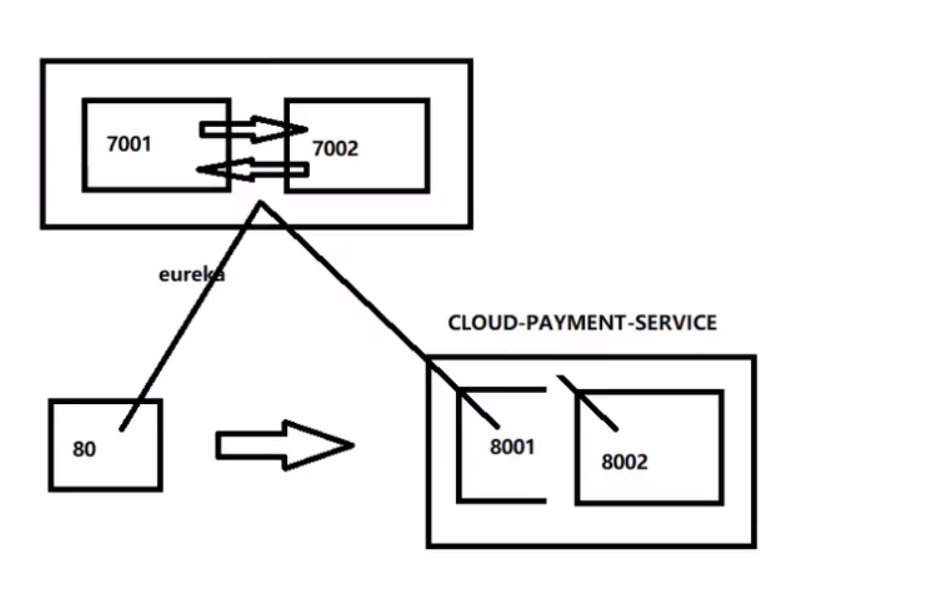

## 3.6 actuator微服务信息完善

主机名称：服务名称修改（也就是将IP地址，换成可读性高的名字）

修改cloud-provider-payment8001，cloud-provider-payment8002

修改部分 - YML - eureka.instance.instance-id

~~~yml
eureka:
  ...
  instance:
    instance-id: payment8001 #添加此处
~~~

修改之后

eureka主页将显示payment8001，payment8002代替原来显示的IP地址。

------

访问信息有IP信息提示，（就是将鼠标指针移至payment8001，payment8002名下，会有IP地址提示）

修改部分 - YML - eureka.instance.prefer-ip-address

~~~yml

eureka:
  ...
  instance:
    instance-id: payment8001 
    prefer-ip-address: true #添加此处

~~~


改变地址端口显示需要

~~~xml
 <dependency>
            <groupId>org.springframework.boot</groupId>
            <artifactId>spring-boot-starter-web</artifactId>
        </dependency>
        <dependency>
            <groupId>org.springframework.boot</groupId>
            <artifactId>spring-boot-starter-actuator</artifactId>
        </dependency>
~~~

```yml
instance:
  instance-id: order80 #添加此处 设置服务不暴露本机地址
  prefer-ip-address: true #访问路径可以显示ip地址
```


##  3.7 服务发现Discovery

对于注册进eureka里面的微服务，可以通过服务发现来获得该服务的信息

- 修改cloud-provider-payment8001的Controller

~~~java
@RestController
@Slf4j
public class PaymentController{
	...
    
    @Resource
    private DiscoveryClient discoveryClient;

    ...

    @GetMapping(value = "/payment/discovery")
    public Object discovery()
    {
        List<String> services = discoveryClient.getServices();
        for (String element : services) {
            log.info("*****element: "+element);
        }

        List<ServiceInstance> instances = discoveryClient.getInstances("CLOUD-PAYMENT-SERVICE");
        for (ServiceInstance instance : instances) {
            log.info(instance.getServiceId()+"\t"+instance.getHost()+"\t"+instance.getPort()+"\t"+instance.getUri());
        }

        return this.discoveryClient;
    }
}

~~~

- 8001主启动类

```java
@SpringBootApplication
@EnableEurekaClient//开启eureka client 客户端 入驻 server
@EnableDiscoveryClient// 开启服务注册发现  发现微服务
public class PaymentMain8001 {

    public static void main(String[] args) {
        SpringApplication.run(PaymentMain8001.class,args);
    }
}
```

- 自测

先要启动EurekaSeryer

再启动8001主启动类，需要稍等一会儿

浏览器输入http://localhost:8001/payment/discovery

浏览器输出：

```json
{
services: [
"cloud-payment-service",
"cloud-order-service"
],
order: 0
}
```

后台输出：

```shell
2021-06-16 16:16:26.423  INFO 16528 --- [nio-8001-exec-1] c.g.s.controller.PaymentController       : -----element:cloud-payment-service
2021-06-16 16:16:26.424  INFO 16528 --- [nio-8001-exec-1] c.g.s.controller.PaymentController       : -----element:cloud-order-service
2021-06-16 16:16:26.425  INFO 16528 --- [nio-8001-exec-1] c.g.s.controller.PaymentController       : CLOUD-PAYMENT-SERVICE	192.168.76.1	8002	http://192.168.76.1:8002
2021-06-16 16:16:26.425  INFO 16528 --- [nio-8001-exec-1] c.g.s.controller.PaymentController       : CLOUD-PAYMENT-SERVICE	192.168.76.1	8001	http://192.168.76.1:8001
```

## 3.8 Eureka 自我保护理论知识

**概述**

保护模式主要用于一组客户端和Eureka Server之间存在网络分区场景下的保护。一旦进入保护模式，Eureka Server将会尝试保护其服务注册表中的信息，不再删除服务注册表中的数据，也就是不会注销任何微服务。

如果在Eureka Server的首页看到以下这段提示，则说明Eureka进入了保护模式:

==EMERGENCY! EUREKA MAY BE INCORRECTLY CLAIMING INSTANCES ARE UP WHEN THEY’RE NOT. RENEWALS ARE LESSER THANTHRESHOLD AND HENCE THE INSTANCES ARE NOT BEING EXPIRED JUSTTO BE SAFE==

**导致原因**

一句话：某时刻某一个微服务不可用了，Eureka不会立刻清理，依旧会对该微服务的信息进行保存。

属于CAP里面的AP分支。

**为什么会产生Eureka自我保护机制?**

为了EurekaClient可以正常运行，防止与EurekaServer网络不通情况下，EurekaServer不会立刻将EurekaClient服务剔除

**什么是自我保护模式?**

默认情况下，如果EurekaServer在一定时间内没有接收到某个微服务实例的心跳，EurekaServer将会注销该实例(默认90秒)。但是当网络分区故障发生(延时、卡顿、拥挤)时，微服务与EurekaServer之间无法正常通信，以上行为可能变得非常危险了——因为微服务本身其实是健康的，此时本不应该注销这个微服务。Eureka通过“自我保护模式”来解决这个问题——当EurekaServer节点在短时间内丢失过多客户端时(可能发生了网络分区故障)，那么这个节点就会进入自我保护模式。

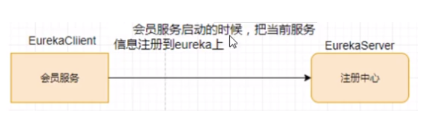

> 自我保护机制∶默认情况下EurekaClient定时向EurekaServer端发送心跳包
>

如果Eureka在server端在一定时间内(默认90秒)没有收到EurekaClient发送心跳包，便会直接从服务注册列表中剔除该服务，但是在短时间( 90秒中)内丢失了大量的服务实例心跳，这时候Eurekaserver会开启自我保护机制，不会剔除该服务（该现象可能出现在如果网络不通但是EurekaClient为出现宕机，此时如果换做别的注册中心如果一定时间内没有收到心跳会将剔除该服务，这样就出现了严重失误，因为客户端还能正常发送心跳，只是网络延迟问题，而保护机制是为了解决此问题而产生的)。

**在自我保护模式中，Eureka Server会保护服务注册表中的信息，不再注销任何服务实例。**

它的设计哲学就是宁可保留错误的服务注册信息，也不盲目注销任何可能健康的服务实例。一句话讲解：好死不如赖活着。

综上，自我保护模式是一种应对网络异常的安全保护措施。它的架构哲学是宁可同时保留所有微服务（健康的微服务和不健康的微服务都会保留）也不盲目注销任何健康的微服务。使用自我保护模式，可以让Eureka集群更加的健壮、稳定。
