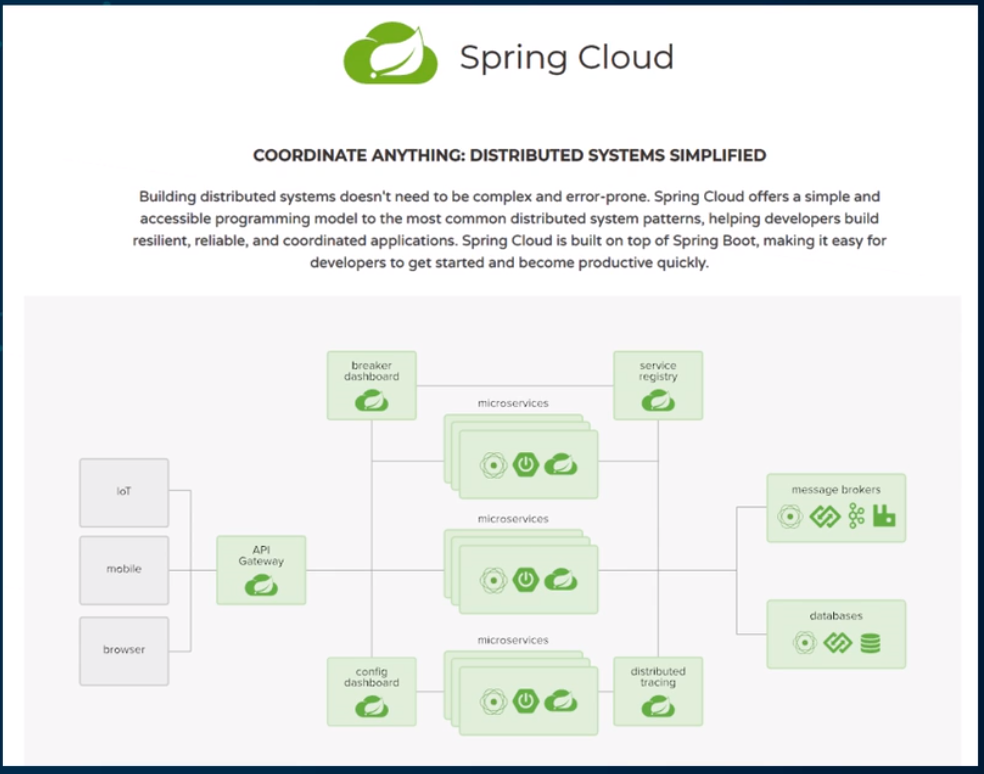
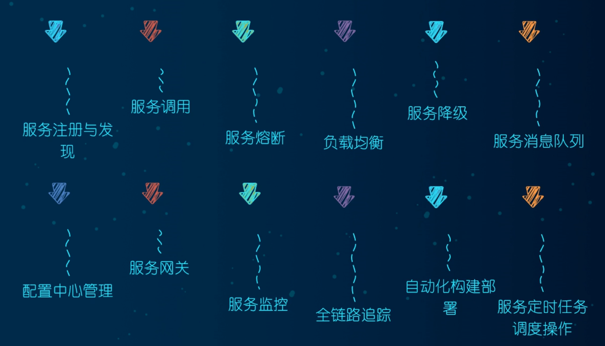
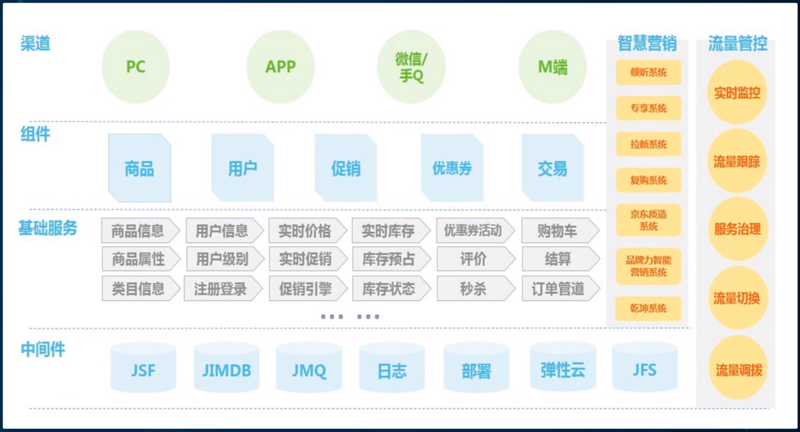
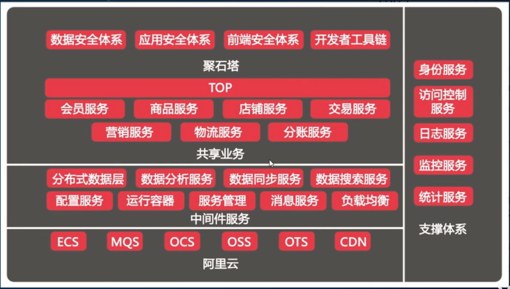
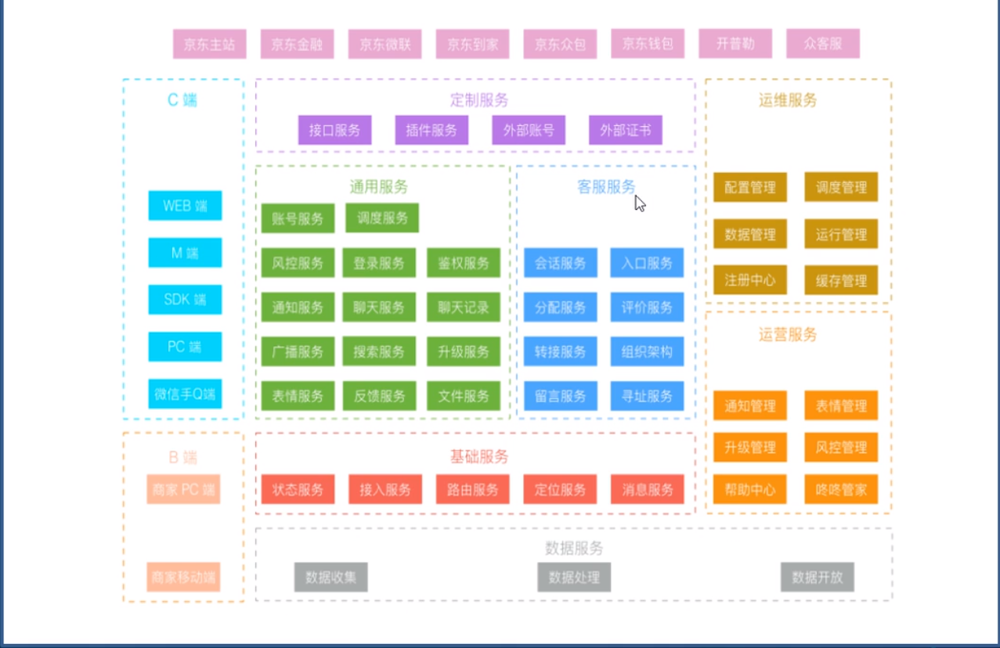
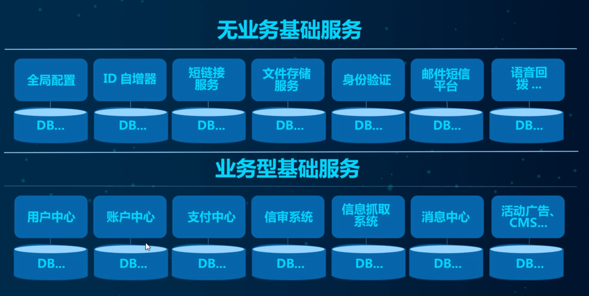
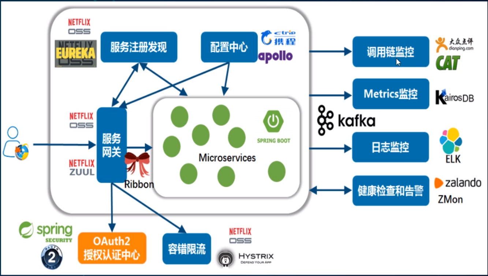
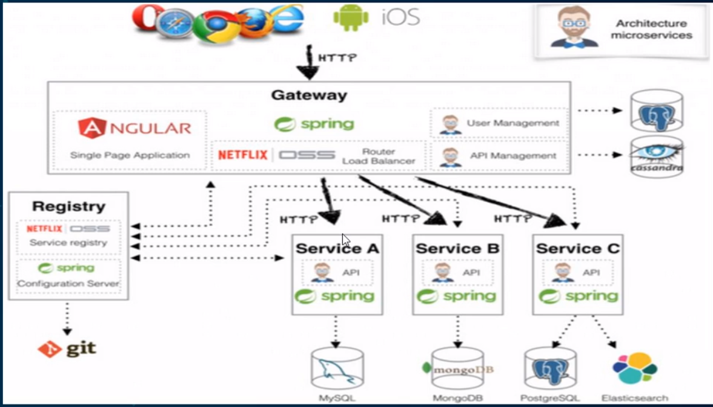
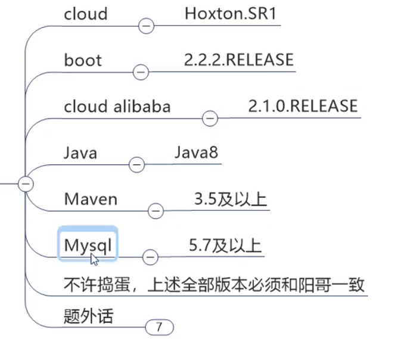
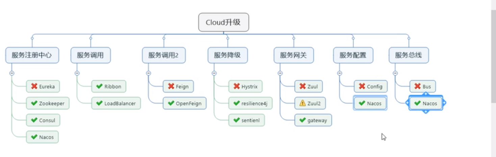

# Spring-Cloud

# 第一章 微服务架构

## 1.1 微服务架构概述

> 概述


==基于分布式的微服务架构==





## 1.2 Spring Cloud 简介

> 简介


- 京东商城 微服务 架构体系



- 阿里云



- 京东物流




- 无业务基础服务 与 业务型基础服务



## 1.3 Spring Cloud技术栈



- **主要技术栈**

> - 服务注册与发现
>   - EUREKA
> - 服务负载与调用    
>   - NETFLIX OSS RIBBON
>   - NETFLIX FEIGN
> - 服务熔断降级
>   - HYSTRIX
> - 服务网关
>   - NETFLIX OSS Zuul
> - 服务分布式配置
>   - Spring Cloud Config
> - 服务开发
>   - Spring Boot


## 1.4 总结



# 第二章 springcloud 工程组件

> 版本选择

版本:springboot 2.0（2.2/2.3） & spring cloud H版 

版本配置




H版 版本

https://docs.spring.io/spring-cloud/docs/Hoxton.SR11/reference/html/

> **SpringCloud** 组件 更替




## 2.1 springcloud 父工程创建

约定 > 配置 > 编码

> 创建微服务cloud整体聚合父工程Project，有8个关键步骤：
>
> - New Project - maven工程 - create from archetype: maven-archetype-site
> - 聚合总父工程名字
> - Maven选版本
> - 工程名字
> - 字符编码 - Settings - File encoding
> - 注解生效激活 - Settings - Annotation Processors
> - Java编译版本选8
> - File Type过滤 - Settings - File Type

父工程pom文件


```xml
<?xml version="1.0" encoding="UTF-8"?>

<project xmlns="http://maven.apache.org/POM/4.0.0" xmlns:xsi="http://www.w3.org/2001/XMLSchema-instance"
         xsi:schemaLocation="http://maven.apache.org/POM/4.0.0 http://maven.apache.org/xsd/maven-4.0.0.xsd">
    <modelVersion>4.0.0</modelVersion>  
    <groupId>com.lun</groupId>
    <artifactId>LearnCloud</artifactId>
    <version>1.0.0-SNAPSHOT</version>
    <packaging>pom</packaging><!-- 这里添加，注意不是jar或war -->

    <!-- 统一管理jar包版本 -->
    <properties>
        <project.build.sourceEncoding>UTF-8</project.build.sourceEncoding>
        <maven.compiler.source>1.8</maven.compiler.source>
        <maven.compiler.target>1.8</maven.compiler.target>
        <junit.version>4.12</junit.version>
        <log4j.version>1.2.17</log4j.version>
        <lombok.version>1.16.18</lombok.version>
        <mysql.version>5.1.47</mysql.version>
        <druid.version>1.1.16</druid.version>
        <mybatis.spring.boot.version>1.3.0</mybatis.spring.boot.version>
    </properties>

    <!-- 子模块继承之后，提供作用：
 锁定版本+子modlue不用写groupId和version -->
    <dependencyManagement>
        <dependencies>
            <!--spring boot 2.2.2-->
            <dependency>
                <groupId>org.springframework.boot</groupId>
                <artifactId>spring-boot-dependencies</artifactId>
                <version>2.2.2.RELEASE</version>
                <type>pom</type>
                <scope>import</scope>
            </dependency>
            <!--spring cloud Hoxton.SR1-->
            <dependency>
                <groupId>org.springframework.cloud</groupId>
                <artifactId>spring-cloud-dependencies</artifactId>
                <version>Hoxton.SR1</version>
                <type>pom</type>
                <scope>import</scope>
            </dependency>
            <!--spring cloud alibaba 2.1.0.RELEASE-->
            <dependency>
                <groupId>com.alibaba.cloud</groupId>
                <artifactId>spring-cloud-alibaba-dependencies</artifactId>
                <version>2.1.0.RELEASE</version>
                <type>pom</type>
                <scope>import</scope>
            </dependency>
            <dependency>
                <groupId>mysql</groupId>
                <artifactId>mysql-connector-java</artifactId>
                <version>${mysql.version}</version>
            </dependency>
            <dependency>
                <groupId>com.alibaba</groupId>
                <artifactId>druid</artifactId>
                <version>${druid.version}</version>
            </dependency>
            <dependency>
                <groupId>org.mybatis.spring.boot</groupId>
                <artifactId>mybatis-spring-boot-starter</artifactId>
                <version>${mybatis.spring.boot.version}</version>
            </dependency>
            <dependency>
                <groupId>junit</groupId>
                <artifactId>junit</artifactId>
                <version>${junit.version}</version>
            </dependency>
            <dependency>
                <groupId>log4j</groupId>
                <artifactId>log4j</artifactId>
                <version>${log4j.version}</version>
            </dependency>
            <dependency>
                <groupId>org.projectlombok</groupId>
                <artifactId>lombok</artifactId>
                <version>${lombok.version}</version>
                <optional>true</optional>
            </dependency>
        </dependencies>
    </dependencyManagement>

    <build>
        <plugins>
            <plugin>
                <groupId>org.springframework.boot</groupId>
                <artifactId>spring-boot-maven-plugin</artifactId>
                <configuration>
                    <fork>true</fork>
                    <addResources>true</addResources>
                </configuration>
            </plugin>
        </plugins>
    </build>
</project>
```


